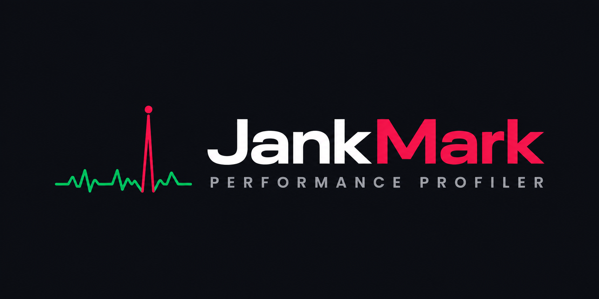

**A free, zero-overlay Android game performance profiler.**

Stream live FPS, frame-time, and hardware telemetry from any Android device to a
clean PC dashboard — over ADB, with no overlay on your phone and nothing written
to the device.

*by SoC Benchmarks*

&nbsp;

&nbsp;

---

## Why JankMark?

Most Android performance tools are either locked behind a paywall, hard to set
up, or not available in English. JankMark is **free to use**, made for the people
who actually care about device performance — smartphone reviewers, benchmarking
enthusiasts, and curious users who want the real numbers behind the marketing.

- **Free.** No paywall, no subscription. If you want to support development,
  that is your choice — never a requirement.
- **Zero overlay.** Nothing is drawn on your phone screen and nothing is written
  to the device. JankMark reads telemetry over ADB from your PC.
- **The numbers reviewers quote.** FPS, frame-time, 5% / 1% / 0.1% lows, jank %,
  plus CPU, GPU, RAM, temperature, and clock frequency telemetry.
- **Beautiful, readable dashboard.** Live charts with synchronized crosshairs,
  not a wall of raw numbers.

## Features

- Live FPS and frame-time graphs with a jank-threshold reference line.
- **5% Low, 1% Low, and 0.1% Low** percentile FPS stats — the numbers that
  tell you how the game feels, not just how fast it runs on average.
- CPU, GPU, RAM, and temperature telemetry with live circular gauges and plots.
- CPU and GPU clock-frequency charts to spot thermal throttling instantly.
- Synchronized crosshair across all charts — hover any point and see the
  correlated values on every other chart at that exact moment.
- Automatic app name + icon lookup for the game you are profiling.
- Exportable, branded session reports (HTML + Markdown).
- USB **or** Wi-Fi (wireless debugging) connection, with multi-device selection.

See [docs/METRICS.md](docs/METRICS.md) for a full explanation of every metric
and how to interpret your results.

## Install

1. Go to the [**Releases**](https://github.com/AbiMangalan/JankMark/releases/latest) page.
2. Download the latest \`JankMark_Setup\` installer.
3. Run it and follow the prompts.
4. Launch JankMark from the Start Menu.

> Windows may show an "unknown publisher" prompt until the app is code-signed.
> See [docs/INSTALL.md](docs/INSTALL.md).

## Requirements

- Windows 10 or 11
- An Android 8.0+ device with **USB debugging** enabled

See [docs/CONNECTING.md](docs/CONNECTING.md) for the full USB and Wi-Fi setup
guide (including how to enable Developer Options).

## Feedback & community

JankMark is **closed source** but free to use, and it is shaped by community
feedback. The best way to help:

- Report a bug: https://github.com/AbiMangalan/JankMark/issues/new?template=bug_report.md
- Request a feature: https://github.com/AbiMangalan/JankMark/issues/new?template=feature_request.md
- Join the discussion: https://github.com/AbiMangalan/JankMark/discussions

Your reports and ideas directly influence what gets built next.

## About

JankMark is made by **[SoC Benchmarks](https://www.youtube.com/@socbenchmarks)** —
a channel about smartphone & tablet System-on-Chip performance and gaming.

## License

JankMark is **free to use**. The software is distributed as compiled binaries;
the source code is proprietary and closed. See [LICENSE](LICENSE).

All rights reserved (c) Abi Mangalan.
